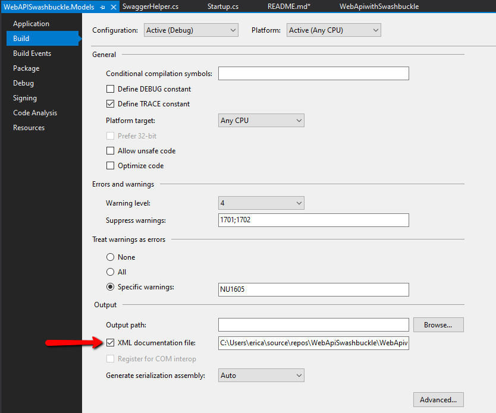

# .Net Core 3.1 Web Api with Swagger
Swashbuckle is the .Net version of [Swagger](https://swagger.io/).
Swagger has become the standard UI for APIs.
Not just .Net but just about every other language on 
the planet too. If you aren't using swagger for your APIs 
you should be. Because swagger has become such a standard
many tools have been created around it. Tools like
[SwaggerCodeGen](https://swagger.io/tools/swagger-codegen/) 
which allows you to automatically 
generate client SDKs in just about every exisitng language. 

### Getting started
Start by creating a .Net Core 3.1 Web API project.
Next [install some nuget packages](https://docs.microsoft.com/en-us/nuget/quickstart/install-and-use-a-package-in-visual-studio).

```
Install-Package Swashbuckle.AspNetCore
Install-Package Microsoft.Extensions.DependencyInjection
Install-Package Microsoft.AspNetCore.Builder
```
Now add a new project to the solution for Models.
Create a new .net core library called [your_project].Models.

>*Note: This is really just to demonstrate how documentation* 
>*on the models help your swagger documentation.*

### Add a swagger helper class
I like to bundle all of the swagger settings and functionality 
into a single class. This makes it easier to make adjustments
to how swagger behaves. Create a class called SwaggerHelper
and some using statements.

```
using Microsoft.OpenApi.Models;
using Swashbuckle.AspNetCore.SwaggerGen;
using Swashbuckle.AspNetCore.Swagger;
using Swashbuckle.AspNetCore.SwaggerUI;
using Microsoft.Extensions.DependencyInjection;
using Microsoft.AspNetCore.Builder;
```

Next add three methods:

```
public static void ConfigureSwaggerGen(SwaggerGenOptions swaggerGenOptions)
{
}

public static void ConfigureSwagger(SwaggerOptions swaggerOptions)
{
}

public static void ConfigureSwaggerUI(SwaggerUIOptions swaggerUIOptions)
{
}
```

The first method is to configure swagger generation, the second
is to configure swagger itself and the last is to configure
the UI. With these three methods in place you have pretty
much everything you'll ever need to configure swagger.
Let's add some code to these methods. In `ConfigureSwaggerGen`
we'll ad two sectiosn of code. The fisrt configures the settings
for Swagger, the second configures swagger for use with [JWT](https://jwt.io/) bearer
tokens. (I usually configure it, even if I may not use it right away)

```
swaggerGenOptions.SwaggerDoc("v1", new OpenApiInfo
{
    Title = "nginx_ssl",
    Version = $"v1",
    Description = "An API for centralized SSL management with Lets Encrypt."
});

swaggerGenOptions.AddSecurityDefinition("Bearer", new OpenApiSecurityScheme()
{
    Description = "JWT Authorization header using the Bearer scheme. Example: \"Authorization: Bearer {token}\"",
    Name = "Authorization",
    In = ParameterLocation.Header,
    Type = SecuritySchemeType.ApiKey
});
```
Next I check the option in both projects to include the xml documentation.



I just accept the default path. Then the final step in the `ConfigureSwaggerGen`
is to make sure this xml documentation is included in swagger.
Since we'll be dealing with files we'll need `System.IO` so we'll add a using statement:

```
using System.IO;
```

Then we add:

```
string filePath = Path.Combine(AppContext.BaseDirectory, "WebApiwithSwashbuckle.xml");
swaggerGenOptions.IncludeXmlComments(filePath);
filePath = Path.Combine(AppContext.BaseDirectory, "WebAPISwashbuckle.Models.xml");
swaggerGenOptions.IncludeXmlComments(filePath);
```

Thsi will insure that our XML documentation is copied to the proper 
directory everytime we run the API.